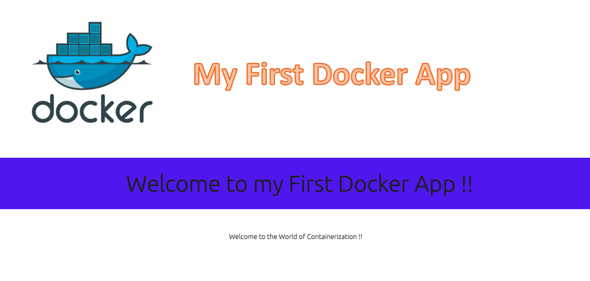

# My First Docker App on Node demonstrating Containerization


## Instructions for use

1. Fork the repo 
2. Clone repo locally
3. Build Docker image `docker image build -t <tag> .` from within the root directory of the repo

	```docker image build -t first-docker-app .```

4. Run container using the created image: `docker run -d --name node-app -p 8080:8080 first-docker-app:latest`
5. Open `http://localhost:8080` to run App on Web Browser
  
6. Push image to DockerHub: `docker image push DockerHub-ID/Repo-Name:Image-Name`
